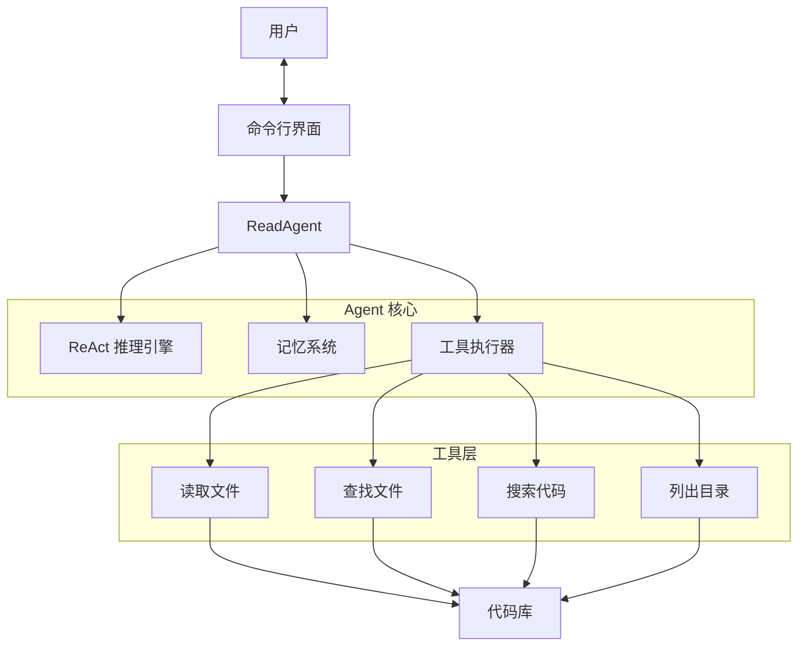

# Read Agent - 轻量级代码阅读助手

一个极其简单、轻量的 AI 代码阅读助手，帮助你通过对话快速理解代码库。

## ✨ 特性

- **轻量简单**：仅使用 Python 标准库，无额外依赖
- **交互式对话**：用自然语言提问，AI 帮你分析代码
- **智能记忆**：自动保存已分析的文件信息，避免重复读取
- **ReAct 模式**：模拟人类思考方式，工具调用更精准
- **流式输出**：实时显示分析过程，响应更及时

## 🚀 快速开始

### 环境要求

- Python 3.7+
- OpenAI API Key

### 安装与配置

1. 克隆项目
2. 配置 API Key

```bash
# 方式一：环境变量
export OPENAI_API_KEY=your-api-key

# 方式二：.env 文件
echo "OPENAI_API_KEY=your-api-key" > .env

# 方式三：命令行参数
python main.py --api-key your-api-key
```

### 运行

```bash
# 使用当前目录
python main.py

# 指定代码目录
python main.py --code-dir /path/to/your/project

# 指定模型
python main.py --model gpt-4
```

## 💬 使用示例

启动后，直接输入问题：

```
🤔 这个项目是做什么的？
🤔 用户认证是如何实现的？
🤔 找到处理 API 请求的代码
🤔 这个函数的作用是什么？
🤔 数据库连接是怎么配置的？
```

可用命令：
- `quit/exit/q` - 退出程序
- `clear` - 清空对话历史
- `status` - 查看当前状态
- `help` - 显示帮助

## 🏗️ 架构设计



## ⚙️ 配置选项

| 参数 | 环境变量 | 默认值 | 说明 |
|------|---------|--------|------|
| `--code-dir` | `CODE_DIR` | `.` | 代码目录路径 |
| `--api-key` | `OPENAI_API_KEY` | - | OpenAI API Key |
| `--base-url` | `OPENAI_BASE_URL` | OpenAI 默认 | API 基础 URL |
| `--model` | `OPENAI_MODEL` | `gpt-4` | 模型名称 |
| `--max-steps` | `MAX_STEPS` | `10` | 最大分析步骤数 |
| `--stream-output` | `STREAM_OUTPUT` | `true` | 启用流式输出 |
| `--no-stream` | - | `false` | 禁用流式输出 |

## 📁 项目结构

```
read-agent/
├── main.py          # 入口文件
├── prompts.py       # 提示词配置
├── .env             # 环境变量配置
└── src/
    ├── __init__.py
    └── agent.py     # Agent 核心逻辑
```

## 🔧 工作原理

1. **理解问题**：分析用户提问，确定需要的信息
2. **选择工具**：根据问题选择合适的工具（读取/搜索/查找）
3. **执行工具**：调用工具获取代码信息
4. **提取记忆**：分析文件后提取关键信息保存
5. **生成回答**：综合所有信息给出答案